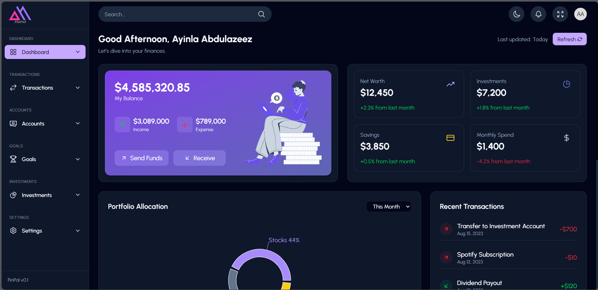

# 💰 FinPal – Fintech Savings & Investment Dashboard

FinPal is a responsive fintech dashboard that helps users manage their finances, track savings goals, monitor investments, and simulate transactions. Built using **React**, **Redux Toolkit**, **Formik**, **Yup**, and **shadcn/ui**.

## 🚀 Live Demo
🔗 [[https://fobework-assessment-e43p2vzet-victoryomowumis-projects.vercel.app/](https://fobework-assessment.vercel.app/)]

## 🎥 Loom Link
🔗 [https://www.loom.com/share/64b05b1b0df14f958946704d2a6dc278?sid=1b0fec2d-52dd-4c89-881e-210c9313c6a1]

---
## 📸 Preview


---

## 🛠 Tech Stack

**Core Framework**  


**State & Data**  


**UI & Styling**  


**Visualization**  


---

## 📦 Features

- 💳 Realistic balance and income/expense view
- 📊 KPI summary cards for net worth, savings, investments, spend
- 🧠 Portfolio allocation chart with custom tooltips
- 🔁 Send & Receive funds simulation
- 🎯 Track multiple savings goals
- 🧾 Recent transaction history
- 🌓 Dark mode support
- ⚡ Responsive on mobile, tablet, and desktop

---

## 🧪 Getting Started

```bash
git clone https://github.com/VictoryOmowumi/fobework-assessment
cd fobework-assessment
npm install
npm run dev
